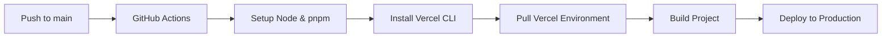

# Complete Vercel CI/CD Setup Guide

This guide covers:
1. **GitHub Actions Security** - Understanding the warning
2. **Vercel Deploy Skill** - Quick one-off deployments
3. **Design Guidelines** - Vercel's design best practices
4. **CI/CD Setup** - Automatic deployments from GitHub

---

## 1. GitHub Actions Security Explained

### What's the Warning About?

GitHub Actions workflows can be vulnerable to **command injection** if they use untrusted user input directly in shell commands.

### UNSAFE Pattern (DON'T DO THIS):
```yaml
run: echo "${{ github.event.issue.title }}"
```

**Why it's unsafe**: If someone creates an issue titled:
```
"; rm -rf / #
```
It would execute as: `echo ""; rm -rf / #"` and delete files!

### SAFE Pattern (DO THIS):
```yaml
env:
  TITLE: ${{ github.event.issue.title }}
run: echo "$TITLE"
```

**Why it's safe**: The value is properly escaped when passed through environment variables.

### Our Workflows Are Safe

Our Vercel deployment workflows **only use**:
- `github.ref` (branch name - controlled by repository)
- `secrets.*` (encrypted secrets - controlled by you)

**No user input is used**, so they're secure! ✅

---

## 2. Vercel Deploy Skill (Quick Deployments)

### What It Does
The skill at `.agent/dx/skills/vercel-deploy/` provides **instant deployments** without authentication.

### When to Use
- Quick prototypes
- Testing deployments
- Sharing demos
- One-off deploys

### How It Works
```bash
bash .agent/dx/skills/vercel-deploy/vercel-deploy/scripts/deploy.sh
```

1. Auto-detects framework (Next.js, React, Vue, etc.)
2. Packages project (excludes node_modules, .git)
3. Uploads to deployment service
4. Returns:
   - **Preview URL** - Live site
   - **Claim URL** - Transfer to your Vercel account

### Features
- ✅ No authentication needed
- ✅ Auto-framework detection
- ✅ Works with 70+ frameworks
- ✅ Returns claimable deployment

---

## 3. Vercel Design Guidelines

### What They Are
Comprehensive design best practices from Vercel covering:

- **Interactions**: Keyboard accessibility, focus management, hit targets
- **Animations**: Reduced motion, GPU acceleration, easing
- **Layout**: Responsive design, alignment, safe areas
- **Content**: Typography, accessibility, empty states
- **Forms**: Labels, validation, error handling
- **Performance**: Re-renders, virtualization, preloading
- **Design**: Colors, contrast, shadows, borders
- **Copywriting**: Active voice, clarity, error messages

### Quick Checklist
- [ ] All interactive elements keyboard accessible
- [ ] Visible focus rings on focusable elements
- [ ] Hit targets ≥24px (44px on mobile)
- [ ] Form inputs have associated labels
- [ ] Loading states don't flicker
- [ ] `prefers-reduced-motion` respected
- [ ] No `transition: all`
- [ ] Color contrast meets APCA standards

### How to Use
Fetch live guidelines: https://vercel.com/design/guidelines

Review your code against these standards before deployment.

---

## 4. CI/CD Setup (Automatic Deployments)

### Architecture

```
Push to main → GitHub Actions → Build → Deploy to Vercel Production
Create PR → GitHub Actions → Build → Deploy to Vercel Preview
```

### Step 1: Get Credentials

#### A. Vercel Token
```bash
vercel tokens create
```
Or visit: https://vercel.com/account/tokens

#### B. Organization & Project IDs
Already in `.vercel/project.json`:
- **VERCEL_ORG_ID**: `team_XScV6EoTIwj6GGG58BQfniDb`
- **VERCEL_PROJECT_ID**: `prj_DjhTlmIrEYiB1m2iYdvata3emQuK`

### Step 2: Add GitHub Secrets

Go to: https://github.com/hellowhq67/pedagogistspte.v.0.2/settings/secrets/actions

Add these 3 secrets:

| Secret Name | Value |
|------------|-------|
| `VERCEL_TOKEN` | Your token from Step 1A |
| `VERCEL_ORG_ID` | `team_XScV6EoTIwj6GGG58BQfniDb` |
| `VERCEL_PROJECT_ID` | `prj_DjhTlmIrEYiB1m2iYdvata3emQuK` |

### Step 3: Environment Variables

All your environment variables are already set in Vercel:
- DATABASE_URL (Neon)
- GOOGLE_GENERATIVE_AI_API_KEY
- ASSEMBLYAI_API_KEY
- BETTER_AUTH_SECRET
- NEXT_PUBLIC_SANITY_* (all Sanity vars)
- And 42 others ✅

**Verify at**: https://vercel.com/hellowhq67s-projects/pedagogistspte-v-0-2/settings/environment-variables

### Step 4: Configure Vercel Project

Visit: https://vercel.com/hellowhq67s-projects/pedagogistspte-v-0-2/settings

#### Git Settings
- Production Branch: `main`
- ✅ Enable: "Automatically deploy commits from main branch"
- ✅ Enable: "Deploy previews for pull requests"

#### Build Settings
- Framework: Next.js (auto-detected)
- Build Command: `pnpm build`
- Output Directory: `.next` (auto)
- Install Command: `pnpm install`

### Step 5: Test Deployments

#### Production Deploy:
```bash
git add .
git commit -m "feat: setup CI/CD"
git push origin main
```

Watch at: https://github.com/hellowhq67/pedagogistspte.v.0.2/actions

#### Preview Deploy:
1. Create branch: `git checkout -b test-feature`
2. Make changes
3. Push: `git push origin test-feature`
4. Create PR to `main`
5. Check PR for preview URL

### How It Works



**For Pull Requests:**
- Same workflow but deploys to preview environment
- Different URL for each PR
- Comment posted on PR with preview link

---

## Deployment Workflows

### Production (`.github/workflows/vercel-deploy.yml`)
**Triggers**: Push to `main`

```yaml
- Checkout code
- Setup Node 20.17.0
- Setup pnpm 10.26.1
- Install Vercel CLI
- Pull production environment
- Build for production
- Deploy to production
```

### Preview (`.github/workflows/vercel-preview.yml`)
**Triggers**: Pull requests to `main`

```yaml
- Same steps but:
  - Pulls preview environment
  - Builds without --prod flag
  - Deploys to preview
```

---

## Monitoring

### GitHub Actions
https://github.com/hellowhq67/pedagogistspte.v.0.2/actions

View:
- Build logs
- Deployment status
- Error messages
- Build times

### Vercel Dashboard
https://vercel.com/hellowhq67s-projects/pedagogistspte-v-0-2

View:
- Live deployments
- Build logs
- Performance metrics
- Function logs

---

## Troubleshooting

### Build Fails
1. Check GitHub Actions logs
2. Verify all secrets are set
3. Check Vercel environment variables
4. Look for TypeScript errors
5. Verify `next.config.ts` is valid

### Deployment Not Triggering
1. Verify workflows exist in `.github/workflows/`
2. Check GitHub Actions are enabled
3. Ensure secrets are set correctly
4. Verify branch name matches trigger

### Environment Variables Missing
Add them in Vercel dashboard:
https://vercel.com/hellowhq67s-projects/pedagogistspte-v-0-2/settings/environment-variables

**Required for all environments:**
- Production
- Preview
- Development

---

## Quick Commands

```bash
# Manual deploy (without CI/CD)
vercel --prod

# Check deployment status
vercel inspect <deployment-url> --logs

# Link project
vercel link

# Pull environment variables locally
vercel env pull .env.local

# Add new environment variable
vercel env add <NAME> production
```

---

## Security Notes

### GitHub Actions Workflows
✅ Our workflows are secure:
- Only use `github.ref` (repository-controlled)
- Only use `secrets.*` (you control these)
- No user input processed
- No command injection risk

### Secrets Management
- ✅ Stored encrypted in GitHub
- ✅ Never visible in logs
- ✅ Scoped to repository
- ✅ Rotatable anytime

### Environment Variables
- ✅ Encrypted in Vercel
- ✅ Not exposed to client
- ✅ Per-environment isolation

---

## Next Steps

1. ✅ Read this guide
2. ⬜ Add 3 GitHub secrets
3. ⬜ Configure Vercel Git settings
4. ⬜ Push to main to trigger first deploy
5. ⬜ Create test PR for preview deploy
6. ⬜ Review Vercel design guidelines
7. ⬜ Setup custom domain (optional)

---

## Support

- **Vercel Docs**: https://vercel.com/docs
- **GitHub Actions**: https://docs.github.com/actions
- **Design Guidelines**: https://vercel.com/design/guidelines
- **Project Dashboard**: https://vercel.com/hellowhq67s-projects/pedagogistspte-v-0-2
